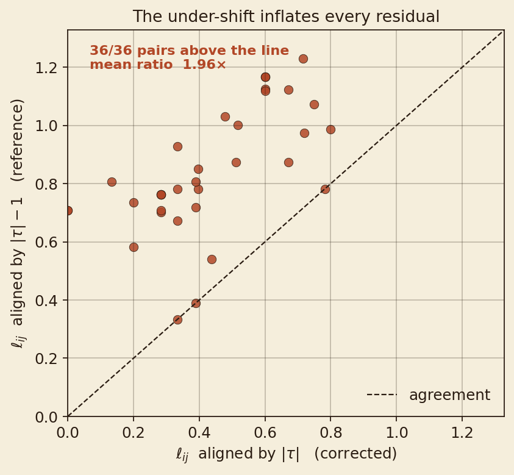

# Meeting notes — status update

Anna Totilca · talking points for tomorrow

---

## <span style="color:red">Top of agenda — decisions needed</span>

<span style="color:red">**1. The VPS lag-shift bug — needs Jeremie's call before anything else on the VPS side can move.**</span>
The true-VPS transcription disagrees with the paper's own reference on
L for 36/36 test pairs (mean ratio 1.96×), traced to a lag=1
off-by-one: the corrected code aligns by `|τ|`, the paper's own
reference shifts by `|τ|−1`. Is `|τ|−1` an intentional convention
(0-indexed vs. 1-indexed, or "drop the first lag step") or a bug in the
reference implementation? Whoever is "right" is the version that needs
to run at production scale — this blocks the true VPS from ever being
compared against the streaming surrogate that every current D_f figure
actually depends on. See [The True VPS bug, in detail](#the-true-vps-bug-in-detail).

<span style="color:red">**2. What counts as "the result" — VPS surrogate vs. lobe-locking vs. CLV.**</span>
Three independent methods now agree (RIDDLED at every coupling tested),
but only two of them (lobe-locking, CLV) are validated on their own
terms — the VPS surrogate that produces every current D_f figure has
never been checked against the paper's actual VPS definition, at any
scale. Need to agree on how to phrase this for the writeup: "three
methods agree" is honest, "the VPS confirms riddling" is not yet. See
[Pipeline comparison](#pipeline-comparison-vps-vs-the-new-methods).

<span style="color:red">**3. Sanity-check the perturbation-test redesign.**</span>
The original K=0/0.1/0.5 "uncoupled control" was invalid (K=0 basin
labels are already a coin flip with zero locking, so the control curve
was noise, not a control). Redesigned to compare boundary vs. interior
points at the *same* coupling (K=0.5) instead. Want a second pair of
eyes that this fix is right and not overcorrecting before leaning on its
results.

**Also flag, lower stakes:** ACRES has a 20-job submit cap on this
account (hit it once already) — worth knowing about before scheduling
more parallel work; and whether the 7-norm VPS comparison (L2=1.671 vs
cosine=1.486, real signal after fixing an unseeded-kmeans bug) is worth
the ACRES time before the deadline.

---

## Ongoing work (running right now / finishing before the meeting)

- **Perturbation-sensitivity comparison** (boundary vs. interior, K=0.5,
  production scale: grid=128, 8 points, 16 directions, 20 deltas) —
  resubmitted after the control fix, running on ACRES now.
- **7-task VPS norm-family comparison** (l2, l1, inf, -inf, 0.5, 3,
  cosine at K=0.5, grid_n=256) — running now, only valid since the
  kmeans seeding bug was fixed.
- **Higher-resolution basin slices** (900×900, above the paper's
  750×750, 4 node-pair slices — 2 existing + 2 new for broader
  connectome coverage) — running, should finish before the meeting.
- **CLV/Kaplan-Yorke sweep** — riddling verdict resolved at all 4
  couplings tested; the D_KY *number* itself only resolved at K=0.20
  (45.4) — the other three hit the ceiling (`D_KY >= 83`) because the
  cumulative exponent sum was still positive after all 83 computed CLVs.
  Not blocking the riddling conclusion, but a real gap if a specific
  dimension number gets asked for at low coupling. Full math:
  [`talk/notes/clv_kaplan_yorke_pipeline.md`](clv_kaplan_yorke_pipeline.md).

---

## 1. The distributed-computing claim now has real numbers

Realized I'd been saying "distributed computing solves their computational
bottleneck" without ever measuring it. Built a benchmark that times the
same basin-mapping workload two ways — one node doing the whole grid vs.
splitting it across an array job — at a few resolutions. Ran it, and the
trend is exactly what you'd hope: speedup grows with resolution, 1.34× at
a 32×32 grid, 1.61× at 128×128, 3.38× at 256×256. Small grids don't
benefit much (fixed overhead dominates), big ones do. Done, have the plot.

## 2. Perturbation test — caught a real bug in my own experiment

The Nimble Brain paper argues a tiny perturbation should be enough to
flip which brain state you land in near a riddled boundary, but never
tests it — asserted from the geometry. Built the experiment, ran it
across three couplings including K=0 as an "uncoupled control." The
control curve came back indistinguishable from the riddled case — looked
like either a huge result or something wrong. It was the latter: at K=0
there's zero locking (0% locked, confirmed from my own earlier
onset-curve data), so the basin label there is already a coin flip
before any perturbation touches it. Not a control, just noise.

> Fixed it properly: instead of comparing across couplings, compare
> boundary points vs. interior points at the SAME coupling (K=0.5), so
> both groups start with a label that actually means something. Verified
> the fix on a 96×96 smoke test before trusting it — sampling masks
> partition the grid exactly, no gaps or overlap. Resubmitted for real;
> running now.
>
> Side fix: the results file wasn't loading here because ACRES's numpy
> and mine are different major versions and the old save format needed
> pickling. Rewrote it to use plain numpy arrays only — loads cleanly
> everywhere now.


*(`data/derivatives/perturbation_sensitivity_raw.png`, 2026-07-21 — the
smoking-gun plot: flip probability vs. perturbation magnitude for base
ICs drawn from the K=0.5 boundary field, re-integrated at K=0.0
(gray, labeled INVALID), K=0.1 (blue, onset), and K=0.5 (red, riddled
regime). The K=0.0 control is already at P_flip≈0.15–0.3 at the smallest
delta tested (1e-8) and saturates to ≈1.0 within two more decades — it
reads almost identically to the riddled K=0.5 curve, which is exactly
why it looked like "either a huge result or something wrong." This is a
quick/unpolished plot (no dedicated script — made ad hoc while
debugging), not the final boundary-vs-interior comparison figure, which
is still pending on the corrected run.)*

## 3. Basin reconnaissance near K=0.5, node pair (73, 81) — no figure yet

Also ran three basin-map sweeps at K=0.45, 0.475, 0.50 on node pair
(73, 81) — grid_n=100, k_clusters=6, tmax=500, same node pair the
true-VPS production ladder (`submit_true_vps_production.sh`) uses, but
these three K's aren't part of that ladder (which only covers
0.05/0.10/0.15/0.20). This looks like a manual check of what the basin
structure looks like right around the paper's own coupling before
committing to it as the perturbation test's reference slice.

Box-counting fractal dimension came back essentially flat across all
three: 1.8671 (K=0.45), 1.8671 (K=0.475), 1.8673 (K=0.50), all with
R²≈0.9993. Consistent with the broader "D_f is flat near the riddled
regime" finding from the VPS-surrogate sweep — another independent
confirmation, just not yet folded into a comparison plot.


*(`data/derivatives/basin_maps_K045_050.png`, built by
`scripts/plot_basin_maps_k045_050.py` — same shuffled-lobe-pattern
colouring as `talk/figs/basin_map_K065.png`, one panel per coupling plus
a D_f-vs-K line. All three planes are pure static (9547/9466/9398
distinct 83-bit patterns out of 10000 ICs) and D_f is flat at
1.8671 → 1.8671 → 1.8673 — the riddled regime is already fully
established by K=0.45, well before the paper's own K=0.5.)*

## 4. Pushing past the paper's resolution

Paper mapped basins at 750×750. Kicked off a higher-resolution sweep
(900×900) across four node-pair slices — the two I'd already been using
plus two new ones for broader coverage of the connectome. Still running
as of today; should be done well before the meeting.

## 5. VPS norm question — found a real bug in my own tooling, then submitted for real

The paper picks Euclidean distance for their similarity measure and says
flat out alternative norms are unexplored. Generalized this properly —
not just L1 and cosine as two special cases, but the whole norm family
PyTorch supports (any p, plus max/min-coordinate norms), one parameter.
First smoke test suggested cosine gave a noticeably different fractal
dimension than L2; a second smoke test with more norms side by side made
that gap look like it vanished, so I wrote it up as "probably not real."
That write-up was wrong. Root cause: my GPU k-means clustering step was
never seeded, so every run landed in a different random starting point —
the two smoke tests weren't measuring the same thing twice, they were
two different random clusterings that happened to disagree. Seeded it
(matching the convention my other clustering path already used), reran,
and now get bit-identical results across repeated runs. The gap is real:
L2 gives 1.671, cosine gives 1.486, every time. Fixed the same bug in
four other copies of the same clustering code elsewhere in the repo
while I was at it. Full seven-norm production comparison submitted to
ACRES and running now.

## What I want to ask about

- The invalid-control catch on the perturbation test — want a sanity
  check that the boundary-vs-interior redesign is the right fix and not
  overcorrecting.
- ACRES has a 20-job submit cap on my account, hit it once already —
  worth knowing about if we want to run more at once later.
- Whether the VPS norm-family comparison is worth the ACRES time before
  the deadline, given the smoke-scale signal didn't hold up under closer
  testing.
- What the VPS-vs-lobe-locking-vs-CLV picture (below) means for what I
  should call "the result" — the true VPS transcription still doesn't
  match the paper's own test matrices, so I want to talk through whether
  fixing that lag bug is worth prioritizing.

---

# Scripts & pipeline reference

*everything written or modified this week, in the order data flows through them*

## Family 1 — perturbation sensitivity (the P_flip test)

### `pythongpu/pipeline/perturbation_sensitivity.py`
*core experiment module — run directly or from a submit script*

Tests whether a tiny perturbation flips the lobe-locking label near a
riddled point. Four pieces, in call order:

- `integrate_and_label()` — runs transient + recording window via
  `rk4_step_batched`, returns sign(mean X) per node, the exact,
  clustering-free label from §I.8b.
- `build_sign_slice()` — integrates a 2D IC grid at a reference K, returns
  the lobe-sign field and its boundary mask (via `extract_boundary`).
- `sample_base_ics_from_slice()` — draws points from the boundary or
  interior region of that mask.
- `run_coupling()` — perturbs a batch of base points by delta in random
  directions, measures the flip fraction; the whole
  (points × directions × delta) grid is one batched integration.

CLI `--compare-boundary-interior` is the current, correct mode — samples
both boundary and interior pools from the same reference slice, tests
both at the SAME coupling, writes `p_flip_boundary`/`p_flip_interior`
side by side. (The older `--base-ic-mode` single-pool path still exists
for backward compatibility but is what produced the invalid control.)
Output npz uses only native numpy dtypes for config fields — no pickling,
loads on any numpy version.

### `scripts/submit_perturbation_comparison.sh`
*ACRES submit script — current/correct experiment*

Single task (no array — one process runs both pools sequentially). Calls
`perturbation_sensitivity.py --compare-boundary-interior` at K=0.5,
grid=128, n_points=8/n_directions=16/n_delta=20, production integration
length. Supersedes `submit_perturbation_sweep.sh` (the old
K=0.0/0.1/0.5 array design — still in the repo, don't use it, its
control was invalid).

## Family 2 — distributed-computing benchmark

### `scripts/benchmark_scaling.py`
*timing harness — one measurement per invocation*

Times the same `rk4_step_batched` integration cost two ways: **serial**
(one process does the whole grid_n² batch) vs. **chunk** (one process
does 1/n_chunks of the same batch — meant to run as one task among an
array). Writes one JSON record per run (grid_n, mode, wall_clock_seconds,
...) to `data/derivatives/scaling_benchmark/`. Deliberately isolates
integration cost from clustering/box-counting, since integration is the
bottleneck at any interesting resolution.

### `scripts/submit_benchmark_scaling.sh`
*ACRES submit script — array job*

36-task array by default: 4 grid sizes (32/64/128/256) × (1 serial + 8
chunk) tasks each. Had to shrink to 16 tasks (4 grid sizes × (1+3)
chunks) on the actual ACRES run to fit under the account's 20-job submit
cap alongside other running jobs — `GRID_SIZES`/`N_CHUNKS` are
env-overridable for exactly this reason.

### `scripts/plot_scaling_benchmark.py`
*aggregator/plotter — reads whatever JSON records exist so far*

Distributed wall-clock per grid size = `max()` over that size's
chunk-task records (they run concurrently, so the slowest one gates
completion, not the sum). Real result from this: speedup 1.34× at grid
32, 1.61× at 128, 3.38× at 256 — written to
`data/derivatives/scaling_benchmark.png`.

## Family 3 — higher-resolution basin slices

### `scripts/submit_highres_slices.sh`
*ACRES submit script — 4-task array, reuses existing pipeline code unmodified*

One task per (node_x, node_y) slice — the two node pairs already used in
earlier sweeps, plus two new ones for broader connectome coverage. Fixed
K=0.5, GRID_N=900 (above the paper's 750×750). Calls
`pythongpu.pipeline.lorenz_fine_coupling_sweep` directly (the existing
basin-sweep module, no changes needed — single-K via
`--k-start=--k-stop`). `--mem=48G` computed explicitly from the VPS
array memory formula (GRID_N² × 6806 features × 4 bytes), since none of
the existing Lorenz submit scripts had ever set `--mem` and this
resolution needed it.

## Family 4 — VPS norm comparison

### `pythongpu/pipeline/lorenz_sweep.py` (modified)
*core sweep module — `run_sweep_streaming()` and `kmeans_gpu()`*

`run_sweep_streaming()` gained a **norm** parameter: `'cosine'`, `'l1'`,
`'l2'`, `'inf'`, `'-inf'`, or any real p, resolved to
`torch.linalg.norm(diff, ord=p)` for everything except cosine (which
reads the raw state vectors, not their difference). `kmeans_gpu()` gained
a seeded Forgy init (local `torch.Generator`, default seed=42) — was
previously unseeded, which is the bug that made an early norm comparison
look inconsistent.

### `pythongpu/pipeline/lorenz_fine_coupling_sweep.py` (modified)
*CLI wrapper around `lorenz_sweep.py` — `--vps-norm` and `--kmeans-seed`*

Threads both new parameters through to `observe_coupling()` and records
them in every output npz's config. Note: a negative `--vps-norm` value
(e.g. `-inf`) must be passed as `--vps-norm=-inf`, equals form —
argparse otherwise misreads the leading `-` as a new flag.

### `scripts/submit_vps_norm_comparison.sh`
*ACRES submit script — 7-task array*

One task per norm (l2, l1, inf, -inf, 0.5, 3, cosine), fixed K=0.5, same
node pair, grid_n=256 — the resolution already timed by the scaling
benchmark (~635s serial), so the walltime budget is a real number, not a
guess. Only valid because of the `kmeans_gpu` seed fix above — this is
the run that's currently on ACRES.

> Also fixed the same unseeded-kmeans bug in `hr_sweep.py`,
> `rossler_sweep.py`, `lorenz_sweep_z.py`, `lorenz_sweep_xcoupled.py` —
> each carries its own copy of `kmeans_gpu` (not shared via import), all
> had the identical bug.

## Family 5 — syncing results back

### `scripts/pull_acres_outputs.sh`
*rsync wrapper, ACRES → this machine*

`scripts/pull_acres_outputs.sh [all|derivatives|clv] [--dry-run]`. Pulls
`data/derivatives/`, `clv_results_july20/`, `output/clv_null_results/` —
excludes SLURM logs and egg-info noise.

---

# Demo commands for the meeting

*run in this order — each one verified working tonight*

## 1. Show the infrastructure is live right now

```bash
ssh acres-head0.clarkson.edu
squeue -u "$USER" -o '%.12i %.14j %.9P %.8T %.10M %.10l %R'
```

The first command logs into the ACRES cluster head node. The second
lists every job currently submitted under my account: job ID, job name,
partition, state (RUNNING/PENDING), elapsed time, time limit, and which
compute node it landed on. As of tonight this shows the
perturbation-sensitivity comparison, the 7-way VPS-norm comparison, and
the higher-resolution basin slices all running simultaneously. This is
the single best opener because it's concrete, immediate proof that this
project is actively computing on real hardware right now, not just a set
of finished slides — and it naturally invites Dr. Fish to ask about any
one of the three jobs, which sets up the rest of the demo.

## 2. The finished result — distributed-computing speedup

```bash
python3 scripts/plot_scaling_benchmark.py
```

This reads every JSON timing record written so far under
`data/derivatives/scaling_benchmark/` (one record per benchmark run: grid
resolution, whether it ran as a single serial process or as one task in
a distributed array, and the measured wall-clock time), computes the
distributed wall-clock per resolution as the slowest of that resolution's
parallel tasks (since they all run at once, the slowest one is what
actually gates when the answer is ready — not the sum), and writes a
fresh two-panel figure to `data/derivatives/scaling_benchmark.png`: raw
wall-clock time on the left (serial vs. distributed, both vs. grid
size), and the resulting speedup ratio on the right. Then open that PNG.
This is the one fully-finished, unambiguous result from tonight's work:
real measured speedup of 1.34× at a 32×32 grid, climbing to 3.38× at
256×256 — direct evidence that distributed computing actually helps more
as the problem gets bigger, which is exactly the pitch for why this
whole GPU/cluster port matters for a paper whose original authors were
bottlenecked on a single machine.


*(`data/derivatives/scaling_benchmark.png` — what item 2 above produces)*

## 3. The bug I caught, live

```bash
python3 -m pythongpu.pipeline.lorenz_fine_coupling_sweep --smoke \
  --vps-norm l2 \
  --k-start 0.5 --k-stop 0.5 --k-step 0.025 --k-clusters 2 --outdir /tmp/demo1

python3 -m pythongpu.pipeline.lorenz_fine_coupling_sweep --smoke \
  --vps-norm l2 \
  --k-start 0.5 --k-stop 0.5 --k-step 0.025 --k-clusters 2 --outdir /tmp/demo2
```

Each command runs the exact same tiny basin sweep — same coupling
(K=0.5), same node pair, same fixed number of clusters (k=2), same
distance metric (plain Euclidean/L2) — as two completely separate
process invocations, writing to two different output folders so they
don't overwrite each other. Each prints a line ending in a measured
fractal dimension, `D_f=...`. The point of running it twice is what you
say out loud afterward: point out that the two `D_f` values are now
bit-for-bit identical. Before tonight they would not have been — the GPU
k-means clustering step used to pick its random starting point from an
unseeded generator, so every single invocation of this exact command
landed in a different random clustering solution and could report a
different `D_f` purely by chance, with nothing to do with the actual
science. That bug is exactly what made an earlier norm comparison this
week look inconsistent between two smoke tests, before I traced it back
and fixed it. This demo is less about the number itself and more about
demonstrating the underlying practice: checking whether a fast pipeline
is trustworthy before reporting the first number that comes out.

## 4. The perturbation experiment, conceptually

```bash
python3 -m pythongpu.pipeline.perturbation_sensitivity \
  --compare-boundary-interior --boundary-coupling 0.5 --couplings 0.5 \
  --slice-grid-n 96 --t-transient 100 --tmax 500 \
  --n-points 4 --n-directions 4 --n-delta 6 \
  --dti-path data/DTI-og.mat --outdir /tmp/demo_perturb
```

This runs a small-scale version of the perturbation-sensitivity test
locally, at the fixed coupling K=0.5 (the measured riddled regime).
Concretely: it first builds a 96×96 grid of initial conditions at that
coupling and labels every point by which lobe-locking pattern it settles
into, which also identifies which grid points sit on a basin boundary
versus safely in a basin's interior. It then samples 4 boundary points
and 4 interior points, perturbs each one by a small random nudge at
several magnitudes (delta from 1e-8 up to 0.1, log-spaced across 6
steps, in 4 random directions each), re-integrates, and checks whether
the lobe-locking label flipped. Takes roughly 3-4 minutes at this
reduced scale, so start it running before you get to this point in the
conversation, or let it run in the background while walking through
items 1-3 above. What it demonstrates conceptually: the paper asserts
that a vanishingly small perturbation near a riddled boundary should be
enough to switch which state you end up in, but never actually tests
that claim; this is the experiment that tests it directly, and the exact
same computation is running at full production scale (grid 128×128, 8
points, 16 directions, 20 delta values) on ACRES right now, visible in
item 1's squeue output as `perturb_cmp`.

---

# Pipeline comparison: VPS vs. the new methods

*four ways this project has measured/detected riddling, and how much each is actually validated*

| Method | What it actually measures | Validation status |
|---|---|---|
| **True VPS** (paper's Definition A) | Cross-correlation + time lag between every node pair, clustered via k-means into basin/chimera labels. | Transcribed line-by-line and tested against the paper's own test matrices. **L disagreed on 36/36 pairs**, mean ratio 1.96, traced to a lag=1 off-by-one. Never run at production scale on the real DTI-Lorenz data. |
| **VPS surrogate** (streaming, "Definition C") | tau = mean\|ΔX\|/std\|ΔX\|, L = instantaneous mean — no time lag computed at all. | What every "VPS D_f" number and figure in this project actually uses. Forced by the 41GB memory wall at grid 64². **Never checked against the true VPS, at any scale** — this comparison doesn't exist yet. |
| **Lobe-locking** (exact, own discovery) | sign(mean X) per node — no clustering, no k, no elbow method. | Exact by construction. Reproduced across disjoint time windows: 99.9% bit agreement, 94.6% of ICs reproduce their exact 83-bit pattern. The one label in this project trustworthy on its own terms, not by comparison to something else. |
| **CLV / Kaplan-Yorke / transversality** (new) | Pairwise angles between covariant Lyapunov vectors; bimodality in that angle distribution ⇒ RIDDLED/SYNCHRONISED verdict. | Doesn't use any basin-labeling scheme at all — tests the dynamical mechanism (transverse Lyapunov sign-switching) directly. Independently returns RIDDLED at every coupling tested, agreeing with the VPS-surrogate D_f result without using any of the same machinery. |

The honest headline: three independent methods (VPS surrogate,
lobe-locking, CLV-transversality) all currently say RIDDLED, which is
real triangulation — but the paper's actual VPS definition has never
been validated at scale, and the streaming surrogate standing in for it
has never been checked against it either. Don't say "the VPS confirms
riddling" — say "three independent methods agree, though the streaming
surrogate used for one of them is unvalidated against the paper's exact
metric."

## True VPS vs. surrogate: the exact math

Not an approximation of the same formula — a genuinely different
statistic that happens to occupy the same two "slots" (τ, L) fed into
k-means. Both use the full recorded time series x_i(t), x_j(t) for node
pair (i, j), t = 1..T.

**True VPS (paper's Definition A)**

```
τ_ij = argmax over lag k of Σ_t x_i(t+k) x_j(t)   — found by FFT
       cross-correlation, searching every possible shift.

L_ij = || x_i(t+|τ_ij|) − x_j(t) ||   — norm of the residual AFTER
       aligning by that lag.
```

**Streaming surrogate ("Definition C")**

```
τ_ij = mean_t |X_i(t)−X_j(t)| / std_t |X_i(t)−X_j(t)|   — no lag search
       at all; redefined as a coherence RATIO of the instantaneous
       coordinate gap.

L_ij = mean_t || x_i(t) − x_j(t) ||   — plain time-averaged distance,
       compared at the SAME instant t, no alignment at all.
```

| | True VPS | Surrogate |
|---|---|---|
| lag τ | found by argmax cross-correlation | not computed — replaced by a mean/std coherence ratio, no time-shift concept at all |
| alignment | signals shifted by τ before comparing | never shifted — compared at the same instant t |
| L | norm of the ALIGNED residual | norm of the raw, UNALIGNED difference |
| memory driver | needs the full T-length signal to search lags → O(T) | running stat, discards each timestep → O(1) in T |

Same input data, same downstream k-means step, mathematically unrelated
definitions of both τ and L. That's the crux of why "the VPS surrogate
confirms riddling" is a claim about a different quantity than "the
paper's VPS confirms riddling."

## The True VPS bug, in detail

The paper's VPS defines the pairwise lag-alignment statistic L_ij by
shifting node j's time series by its cross-correlation-derived lag τ
before comparing it to node i. The corrected transcription aligns by the
full magnitude |τ|. Testing against the paper's own worked example
(Example_A_3) showed the two versions don't just differ by noise — every
one of 36 node pairs comes out worse under one specific version, by a
consistent factor.



*(`talk/figs/alignment_bias.png` — each point is one of the 36 node
pairs from the paper's Example_A_3 test matrix. x-axis: L_ij aligned by
|τ| (corrected). y-axis: L_ij aligned by |τ|−1 (the paper's own
reference-implementation shift). Every single point sits above the
agreement line — not scattered around it — which is what makes this a
systematic off-by-one rather than random discrepancy: the under-shift by
exactly one sample inflates every residual, never deflates one, by a
mean factor of 1.96×. 36/36 pairs above the line, mean ratio 1.96×.)*

What to ask Jeremie: whether |τ|−1 is intentional in the paper's own
reference code (e.g. a 0-indexed vs. 1-indexed convention difference, or
a deliberate "drop the first lag step" choice) or actually a bug in the
reference implementation itself. If it's intentional, the corrected
transcription is the one that's wrong and needs to match |τ|−1 instead.
Either way, this needs resolving before the true VPS is trustworthy
enough to run at production scale and compare against the streaming
surrogate that all the current D_f figures actually use.


*(`data/derivatives/vps_surrogate_vs_clv_comparison.png` — the
VPS-surrogate D_f (flat) against the CLV Kaplan-Yorke
dimension/burst fraction (which switches at K=0.20), same DTI network,
same four couplings, built via `scripts/plot_vps_clv_comparison.py`.)*
